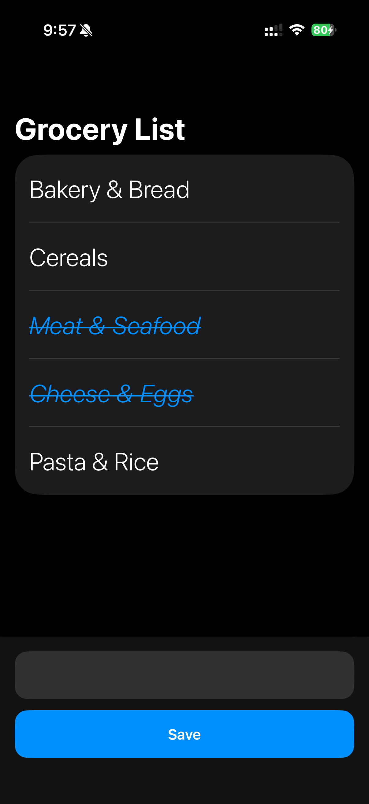
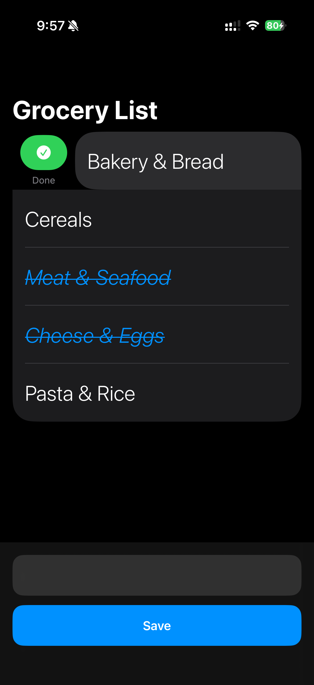
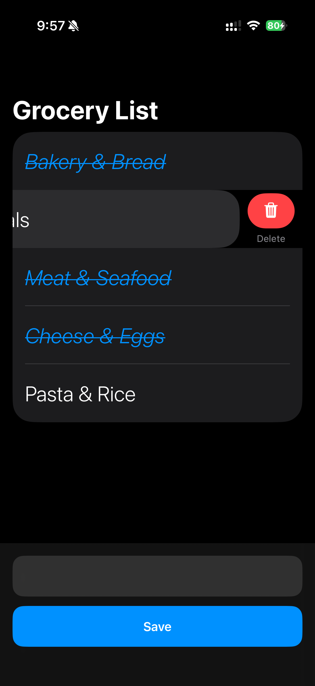

# 🛒 GroceryList

GroceryList is a modern SwiftUI application built with **SwiftData** that helps users manage their grocery shopping efficiently.

The app demonstrates CRUD operations, local persistence, swipe actions, state management, and modern iOS UI patterns while maintaining a clean and intuitive user experience.

---

## ✨ Features

- ➕ Add grocery items
- 💾 Persistent storage using SwiftData
- ✅ Mark items as completed
- 🗑️ Swipe to delete items
- 🥕 Quick-add essential grocery items
- 🛒 Beautiful empty state experience
- 🌙 Dark Mode support
- ⚡ Fast and responsive SwiftUI interface

---

## 📸 Screenshots

<p align="center">
  
  
</p>

<p align="center">
  <b>Empty State</b>
  &nbsp;&nbsp;&nbsp;&nbsp;&nbsp;&nbsp;
  <b>Essential Grocery Items</b>
</p>

<br>

<p align="center">
  
  
</p>

<p align="center">
  <b>Mark as Completed</b>
  &nbsp;&nbsp;&nbsp;&nbsp;&nbsp;&nbsp;
  <b>Swipe to Delete</b>
</p>

---

## 🛠️ Tech Stack

- Swift
- SwiftUI
- SwiftData
- Xcode
- iOS Development

---

## 📂 Architecture

The application follows modern SwiftUI architecture and uses SwiftData for local persistence.

### Core Components

- ContentView
- SwiftData Models
- CRUD Operations
- State Management
- Swipe Actions
- ContentUnavailableView

---

## ⚙️ Requirements

- macOS
- Xcode 15+
- iOS 17+
- Swift 5.9+

---

## 🚀 Installation

Clone the repository:

```bash
git clone git@github.com:DhruvPatel05/GroceryList.git
```

Open the project:

```bash
open GroceryList.xcodeproj
```

Build and run using an iPhone Simulator or physical device.

---

## 📱 User Flow

1. Launch the app
2. Add grocery items using the input field
3. Tap **Save** to store items
4. Swipe right to mark items as completed
5. Swipe left to delete items
6. Use the carrot button to quickly add essential grocery items

---

## 🎯 Learning Highlights

This project demonstrates:

- SwiftData Integration
- CRUD Operations
- Local Data Persistence
- Swipe Actions
- State Management
- SwiftUI Navigation
- Modern iOS UI Design

---

## 👨‍💻 Author

Dhruv Patel

- GitHub: https://github.com/DhruvPatel05
- LinkedIn: https://www.linkedin.com/in/dhruv-patel-csm/

---

## ⭐ Support

If you like this project, please consider giving it a star ⭐
